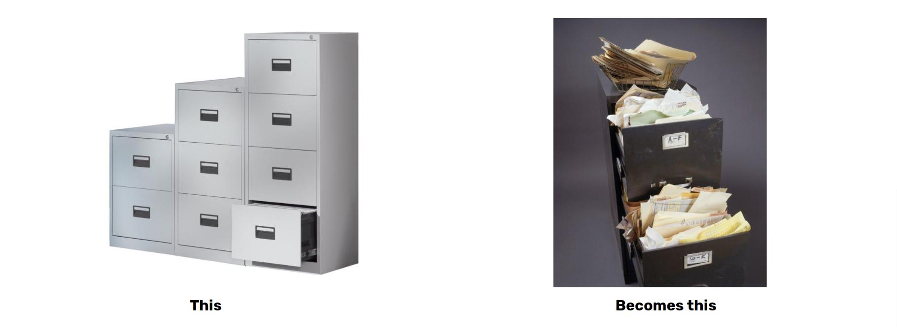
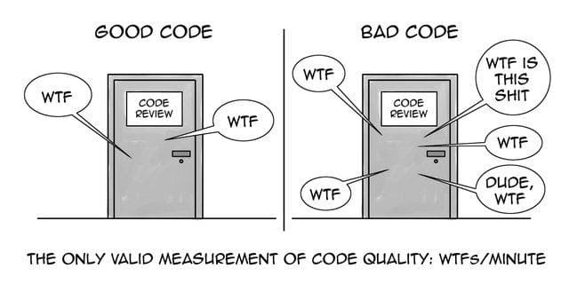
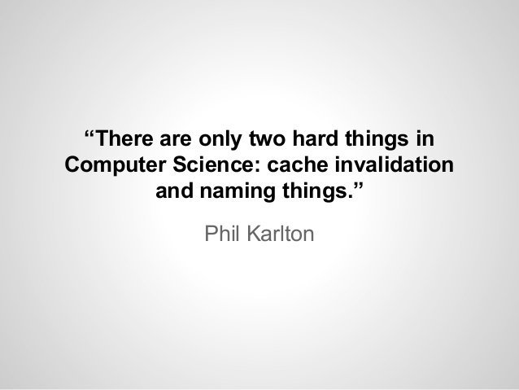

# Clean Code

So far, you have learned much on how to write codes in this program. Take a time to pause and consider, who are you writing for? For sure, whatever lines of code that we write, they are going to be executed by machines. If a machine can't understand our codes, it can't execute whatever fancy things we implement in our code.

However, you have to remember that we also write our codes for other humans:
- Your code will be read more often than it is written
- You (and your machine) are not the only user of your code
- You (most probably) are not the only one that will maintain it


## Cost of Owning a Mess


At the very beginning of the project, the teams are usually moving very fast. Over the span of a year or two, their speed could decrease significantly. Why?
- Every change they make to the code breaks two or three other parts of the code
- New members coming have a hard time understanding the code and might make change that doesn’t follow the initial system design
- Pressures of productivity causing people to add patches to the already problematic code increasing the mess



It becomes harder to even make a small fix or change. Since the code in a module is tangled with the code on another module, and that other module is also tied with another one, so on and so forth.

## What is Clean Code?

- Elegant and efficient. Clean code does one thing well. (Bjarne Stroustrup, inventor of C++)
- Can be enhanced by other developers, has tests, meaningful names, smaller is better. (Big Dave, founder of OTI)
- Pretty much what you expected. (Ward Cunningham, inventor of Wiki)

## What's That Smell?

Take your time to read the following code snippet below and try to figure out what it's trying to do:

```ruby
def reg_usr(params)
a = Data.new(params)
a.role = "admin"
if a.password.blank?
a.gen_pass
end
raise Error::InvalidUserError if a.email.blank?||a.username.blank?||a.phone.blank?||!(a.email.match(/\A[\w+\-.]+@[a-z\d\-.]+\.[a-z]+\z/i))||!(a.phone.match(/\A\+?[\d\s\-\.\(\)]+\z/))
raise Error::DuplicateUser if Data.query("select count(1) from users where phone=#{a.phone} or email=#{a.email}") > 0
a.save
a.sendmailcnfrm
a
end
```

Based on our experience in previous programs, it is likely that the following happened when you tried to understand the code snippet above:



By now, you should have understood that while there is no right or wrong when it comes to writing codes (unless if it doesn't compile or if it crashes, of course, then the code is wrong), some codes are better than the others. And the code snippet above of course can be better. Much more better. Don't you agree?

Now, shall we fix that code?

### Names



Let's start with names. When naming things, consider the following:
- Use intention-revealing names
- Pronounceable and searchable

```ruby
# Bad Code
def getflggdcll
  list1 = []
  list.each do |c|
    if c[0] == 4
      list1.add(c)
    end
  end
  list1
end

# Good Code
def get_flagged_cells
  flagged_cells = []
  
  game_board.each do |cell|
    if cell.is_flagged?
      flagged_cells.add(cell)
    end
  end
  
  flagged_cells
end
```

- Make meaningful distinctions

```ruby
# Bad Code
def reg_usr(params)
  a = Data.new(params)
  a.role = "admin"
  
  if a.password.blank?
  a.gen_pass
  end
  
  a.sendmailcnfrm
end

# Good Code
def register_user(params)
  user = User.new(params)
  user.role = "admin"
  
  if user.password.blank?
    user.generate_password
  end
  
  user.send_email_confirmation
end
```

- Pick one word per concept
- Class names should be a noun, method names should be a verb

```ruby
# Bad Code
class EmployeesController
  def create
  end
  
  def fetch
  end
end

class LocationsManager
  def create
  end
  
  def get
  end
end

class Calculate
  def distance(location1, location2)
  end
end

# Good Code
class EmployeesController
  def create
  end
  
  def get
  end
end

class LocationsController
  def create
  end
  
  def get
  end
end

class Location
  def calculate_distance(other_location)
  end
end
```

### Comments

It is tempting to go back to our previous code snippet and just put comments to explain our code:

```ruby
# save user with auto generated password if user does not give password on registration.
# default role is temp
# return error if user email/username/phone is empty.
def reg_usr(params)
  # -cut-
 end
```

However, it's much better:
- Explain yourself in code
- The best comment is a good name for a method or class
- Don’t use a comment when you can use a function or a variable

Take a look at the following code snippet. Do you understand the code better now?

```ruby
def register_user(params)
  user = User.new(params)
  user.role = "admin"
  if user.password.blank?
  user.generate_password
  end
  raise Error::InvalidUserError if user.email.blank?||user.username.blank?||user.phone.blank?||!(user.email.match(/\A[\w+\-.]+@[a-z\d\-.]+\.[a-z]+\z/i))||!(user.phone.match(/\A\+?[\d\s\-\.\(\)]+\z/))
  raise Error::DuplicateUser if User.query("select count(1) from users where phone=#{user.phone} or email=#{user.email}") > 0
  user.save
  user.send_email_confirmation
  user
end
```

### Formatting

- Vertical formatting
  - Vertical openness
  - Vertical density
  - Vertical ordering
- Horizontal formatting
  - Horizontal alignment
  - Indentation
- Consistent

Let's try to apply a better formatting to our previous code snippet:

```ruby
def register_user(params)
  user = User.new(params)
  user.role = "admin"
  
  if user.password.blank?
    user.generate_password
  end
  
  if user.email.blank? or 
    user.username.blank? or 
    user.phone.blank? or 
    !(user.email.match(/\A[\w+\-.]+@[a-z\d\-.]+\.[a-z]+\z/i)) or 
    !(user.phone.match(/\A\+?[\d\s\-\.\(\)]+\z/))
      raise Error::InvalidUserError
  
  if User.query("select count(1) from users where phone=#{a.phone} or email=#{user.email}") > 0
    raise Error::DuplicateUser 
  
  user.save
  user.send_email_confirmation
  user
end
```

### Unit Tests

- One assert per test
- F.I.R.S.T (fast, independent, repeatable, self-validating, timely/thorough)
- Aim for expressiveness, not efficiency

### Functions

Functions should be:
- Small
- Do one thing
- Limit arguments

```ruby
# Doing too many things
def email_clients(clients)
  clients.each do |client|
    client_record = database.lookup(client)
    email(client) if client_record.active?
  end
end

# Doing one thing, delegating the other thing to another method
def email_active_clients(clients)
  clients.each do |client|
    email(client) if client.active?
  end
end

def active?
  client_record = database.lookup(client)
  client_record.active?
end
```

- Prefer fewer arguments
- Have no side effects

  A function or method should not do anything other than what its name describe.

  State changing actions such as as writing files, storing to database, and changing a variable's value should never be done as a side effect.

Let's get back to our previous code snippet:

```ruby
def register_user(params)
  user = User.new(params)
  user.role = "admin"
  
  if user.password.blank?
    user.generate_password
  end

  raise Error::InvalidUserError if !valid_user?
  raise Error::DuplicateUser if existing_user_count(user.phone, user.email) > 0

  user.save
  user.send_email_confirmation
  user
end

def valid_user?(user)
  !user.email.blank? and
  !user.username.blank? and
  !user.phone.blank? and
  user.email.match(/\A[\w+\-.]+@[a-z\d\-.]+\.[a-z]+\z/i) and
  user.phone.match(/\A\+?[\d\s\-\.\(\)]+\z/)
end

def existing_user_count(phone, email)
  User.query("select count(1) from users where phone=#{phone} or email=#{email}")
end
```

### General Principles

**1 - Don’t Repeat Yourself**

"Every piece of knowledge must have a single, unambiguous, authoritative representation within the system," wrote Andy Hunt and Dave Thomas in The Pragmatic Programmer.

The rule of three:
- When you’re doing something for the first time, just get it done.
- When you’re doing something similar for the second time, cringe at having to repeat but do the same thing anyway.
- When you’re doing something for the third time, start refactoring.

**2 - Follow The Law of Demeter**

A method f of a class C should only call the methods of:
- objects from class C
- objects created by f
- objects passed as arguments to f
- objects held in instance variable of C

**3 - Follow Conventions**

The environment in which you work (language, libraries, etc.) assumes many logical situations by default, so if you adapt to them rather than creating your own rules each time, programming becomes an easier and more productive task.

The goal is to decrease the number of decisions a programmer has to make and eliminate the complexity of having to configure all and each of the areas of application development. The immediate result is that you can create many more things in less time.

**4 - Follow SOLID Principles**

We will learn about this in the next module.

**5 - Follow a Design Pattern**

Design patterns are typical solutions to common problems in software design. Each pattern is like a blueprint that you can customize to solve a particular design problem in your code. 

Recommended reading: [Design Patterns](https://refactoring.guru/design-patterns) by Refactoring Guru.

# Homework

As you are now working on your final project, try to implement principles we learned above on your final project code.
